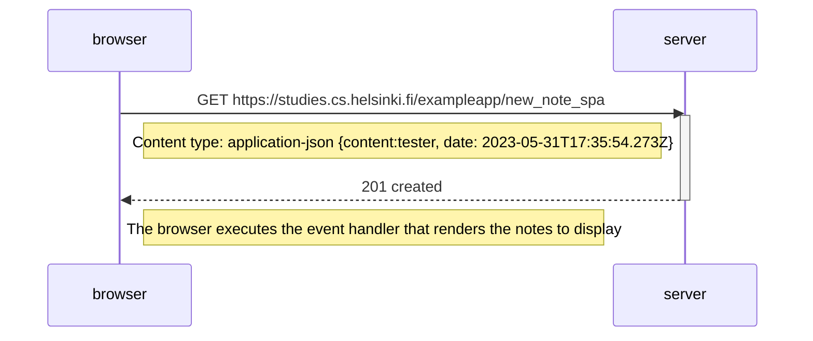

Flow chart of creating a new note in a single page web application:

```mermaid
sequenceDiagram
    participant browser
    participant server

    browser->>server: GET https://studies.cs.helsinki.fi/exampleapp/new_note_spa
    activate server
    Note right of browser: Content type: application-json {content:tester, date: 2023-05-31T17:35:54.273Z}
    server-->>browser: 201 created
    deactivate server

    Note right of browser: The browser executes the event handler that renders the notes to display
```